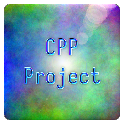

# CPP Project 


---

***This project is*** ![Under Construction](https://img.shields.io/static/v1?logo=data:image/png;base64,iVBORw0KGgoAAAANSUhEUgAAAA4AAAAOCAYAAAAfSC3RAAACmElEQVQokUWSa0iTcRTGn//26u4b6ZQ0U8lKMqykwPpgZVBEHyLp8jEoIZJADCQ0iCiStIwuZmHRioIuroQss2VkrkIrdeFckiZqdhctTXPOve8Tr7M6X8/zO+fwPEfIwy7IwQA0GgExGYQwyhCmMLRX1z2hJCJSN+xZgqAZnPgCaAUQ0EHICjSYLlKBCDdNQb7HLmeRoy3zQFnzYk/1WTckGUIXCVD+Kw+BpAxtuBXCpkN7bdXt/JL3W3J3xuHg3iTsL/NkNFWVPoWkQOj/wxooCrRhFgiTjI4n9ZVHHQObjxVEY8UGIi1zEhVFCahwdq5qvn+hHkKC0EcBigxwvAnkW3ge7L6TMi+VztOLOOKOY8ulKL68GM2emnjeLF3AZSlz2FCZ6yaHwLGv6pkv8MyxsUoHLcsLwBuHwE0rtdy2UuLWNTpmpkkszQEfnAPDAd47tbaB7NaJR+eXujfmtGTUXgFWp5uwPd8Oi1GBJEmwWYlP34L4PSFw7chPeD+MYnkWUVmy0CeNfe5N8ANIjNWpNmHzqklYrDIGRwRm2gXsM/xofRMOf1AgcbYOAfgxMvgxCmS9+dbh5A6VarxuIMdBDoJ0g+vSreytNpAEux7qqWrK82I+kC2xYOAzyFbz5QNJPrXhdRo4XK/n3WILkxPsbKqwsr8xBB3PjukhGyJJv+qqB+QvkN0mR2Fim5pU1hobzxTYOPbcyJoTNpoAlu6wdZKvIslR0O9VXe0Clc5p2Ge4WDh36ux3ThM/1RqnNhXvilU32cjvINtAf4cKdkzlSHpBTqgNY11JfLtFA+o14NU8Wx/piggNfg2yGVR8EF9/dP37PyCIoDQLs8z9hmv71nsC4wFz9klX2tD4/AEG+gBoQ7KghD8MZ2xdnt7s7wAAAABJRU5ErkJggg==&label=Under&message=Construction&style=for-the-badge&labelColor=1D1D1D&color=ffff99)

- [ ] Add TOC

---

## About

&#x41;&#x6c;&#x6c;&#x20;&#x66;&#x69;&#x6c;&#x65;&#x73;&#x20;&#x63;&#x61;&#x6e;&#x20;&#x62;&#x65;&#x20;&#x66;&#x6f;&#x75;&#x6e;&#x64;&#x20;&#x6f;&#x6e;&#x20;&#x74;&#x68;&#x65;&#x20;[Releases](https://github.com/Lateralus138/cppproject_linux/releases)&#x20;&#x70;&#x61;&#x67;&#x65;&#x2e;

### Description

- [x] Add Description

This is a command line tool to help initiate my custom Linux **C++** (*g++*) project system by creating the directory tree, Makefile, main source file, possible prebuild script, possible class files, and all the basic boilerplate code I almost always start with.

I have my own style of programming and, of course, my style is not for everyone, but if you would like to use my system then by all means... More information on my style is provided below.

### Motivation

- [x] Add Motivation

I have been meaning to write this for a long time and, of course, time is hard to find, but I finally got around to writing this. For years I have usually written scripts and/or copied old project files to a new project to help start my projects, but with this I can quickly initiate my projects within a minute and usually less. Especially times when I'm on a roll and start many projects all at once I can script the project creation with config file. 

---

## Usage

### Environment

- [x] Add Environment

&#x54;&#x68;&#x69;&#x73;&#x20;&#x69;&#x73;&#x20;&#x61;&#x6E;&#x20;&#x6F;&#x70;&#x65;&#x6E;&#x2D;&#x73;&#x6F;&#x75;&#x72;&#x63;&#x65;&#x20;&lpar;[FOSS](https://duckduckgo.com/?q=foss&ia=web)&rpar;&#x20;&#x63;&#x6F;&#x6D;&#x6D;&#x61;&#x6E;&#x64;&#x20;&#x6C;&#x69;&#x6E;&#x65;&#x20;&#x75;&#x74;&#x69;&#x6C;&#x69;&#x74;&#x79;&#x20;&#x66;&#x6F;&#x72;&#x20;&#x75;&#x73;&#x65;&#x20;&#x69;&#x6E;&#x20;&#x4C;&#x69;&#x6E;&#x75;&#x78;&#x20;&#x73;&#x68;&#x65;&#x6C;&#x6C;&#x73;&#x20;&lpar;&#x74;&#x65;&#x72;&#x6D;&#x69;&#x6E;&#x61;&#x6C;&#x73;&sol;&#x74;&#x74;&#x79;&#x73;&sol;&#x65;&#x74;&#x63;&period;&rpar;&period;&#x20;&#x54;&#x68;&#x69;&#x73;&#x20;&#x63;&#x61;&#x6E;&#x20;&#x62;&#x65;&#x20;&#x62;&#x75;&#x69;&#x6C;&#x74;&#x20;&#x66;&#x72;&#x6F;&#x6D;&#x20;&#x73;&#x6F;&#x75;&#x72;&#x63;&#x65;&#x20;&lpar;&#x61;&#x73;&#x20;&#x70;&#x65;&#x72;&#x20;&#x74;&#x68;&#x65;&#x20;&#x4C;&#x49;&#x43;&#x45;&#x4E;&#x53;&#x45;&#x20;&#x66;&#x69;&#x6C;&#x65;&#x20;&#x70;&#x72;&#x6F;&#x76;&#x69;&#x64;&#x65;&#x64;&rpar;&comma;&#x20;&#x75;&#x73;&#x65;&#x64;&#x20;&#x70;&#x6F;&#x72;&#x74;&#x61;&#x62;&#x6C;&#x79;&#x20;&lpar;&#x73;&#x69;&#x6E;&#x67;&#x6C;&#x65;&#x20;&#x65;&#x78;&#x65;&#x63;&#x75;&#x74;&#x61;&#x62;&#x6C;&#x65;&#x20;&#x70;&#x75;&#x74;&#x20;&#x77;&#x68;&#x65;&#x72;&#x65;&#x76;&#x65;&#x72;&#x20;&#x79;&#x6F;&#x75;&#x20;&#x6C;&#x69;&#x6B;&#x65;&rpar;&comma;&#x20;&#x6F;&#x72;&#x20;&#x69;&#x6E;&#x73;&#x74;&#x61;&#x6C;&#x6C;&#x65;&#x64;&#x20;&#x76;&#x69;&#x61;&#x20;&#x74;&#x68;&#x65;&#x20;&#x70;&#x72;&#x6F;&#x76;&#x69;&#x64;&#x65;&#x64;&#x20;&#x44;&#x65;&#x62;&#x69;&#x61;&#x6E;&#x20;&lpar;&period;&#x64;&#x65;&#x62;&rpar;&#x20;&#x70;&#x61;&#x63;&#x6B;&#x61;&#x67;&#x65;&period;

&#x54;&#x68;&#x65;&#x20;&#x72;&#x65;&#x63;&#x6F;&#x6D;&#x6D;&#x65;&#x6E;&#x64;&#x65;&#x64;&#x20;&#x6D;&#x65;&#x74;&#x68;&#x6F;&#x64;&#x20;&#x6F;&#x66;&#x20;&#x75;&#x73;&#x65;&#x20;&#x69;&#x73;&#x20;&#x76;&#x69;&#x61;&#x20;&#x74;&#x68;&#x65;&#x20;&#x44;&#x65;&#x62;&#x69;&#x61;&#x6E;&#x20;&#x70;&#x61;&#x63;&#x6B;&#x61;&#x67;&#x65;&#x20;&#x69;&#x6E;&#x73;&#x74;&#x61;&#x6C;&#x6C;&#x61;&#x74;&#x69;&#x6F;&#x6E;&#x20;&#x66;&#x6F;&#x72;&#x20;&#x74;&#x68;&#x65;&#x20;&#x44;&#x65;&#x62;&#x69;&#x61;&#x6E;&#x20;&lpar;&#x61;&#x70;&#x74;&comma;&#x20;&#x64;&#x65;&#x62;&rpar;&#x20;&#x70;&#x61;&#x63;&#x6B;&#x61;&#x67;&#x65;&#x72;&#x20;&#x6D;&#x61;&#x6E;&#x61;&#x67;&#x65;&#x72;&comma;&#x20;&#x62;&#x75;&#x74;&#x20;&#x74;&#x68;&#x65;&#x72;&#x65;&#x20;&#x61;&#x72;&#x65;&#x20;&#x6F;&#x74;&#x68;&#x65;&#x72;&#x20;&#x6D;&#x65;&#x74;&#x68;&#x6F;&#x64;&#x73;&#x20;&#x70;&#x72;&#x6F;&#x76;&#x69;&#x64;&#x65;&#x64;&#x20;&#x68;&#x65;&#x72;&#x65;&#x20;&#x6F;&#x72;&#x20;&#x69;&#x66;&#x20;&#x79;&#x6F;&#x75;&#x20;&#x77;&#x6F;&#x75;&#x6C;&#x64;&#x20;&#x63;&#x61;&#x72;&#x65;&#x20;&#x74;&#x6F;&#x20;&#x70;&#x72;&#x6F;&#x76;&#x69;&#x64;&#x65;&#x20;&#x61;&#x6E;&#x20;&#x69;&#x6E;&#x73;&#x74;&#x61;&#x6C;&#x6C;&#x65;&#x72;&#x20;&#x66;&#x6F;&#x72;&#x20;&#x61;&#x20;&#x64;&#x69;&#x66;&#x66;&#x65;&#x72;&#x65;&#x6E;&#x74;&#x20;&#x70;&#x61;&#x63;&#x6B;&#x61;&#x67;&#x65;&#x20;&#x6D;&#x61;&#x6E;&#x61;&#x67;&#x65;&#x72;&#x20;&#x74;&#x68;&#x65;&#x6E;&#x20;&#x70;&#x6C;&#x65;&#x61;&#x73;&#x65;&#x20;&#x66;&#x6F;&#x72;&#x6B;&#x20;&#x74;&#x68;&#x69;&#x73;&#x20;&#x70;&#x72;&#x6F;&#x6A;&#x65;&#x63;&#x74;&comma;&#x20;&#x62;&#x75;&#x69;&#x6C;&#x64;&#x20;&#x74;&#x68;&#x65;&#x20;&#x61;&#x70;&#x70;&#x72;&#x6F;&#x70;&#x72;&#x69;&#x61;&#x74;&#x65;&#x20;&#x77;&#x6F;&#x72;&#x6B;&#x66;&#x6C;&#x6F;&#x77;&#x20;&#x61;&#x6E;&#x64;&#x20;&#x73;&#x6F;&#x75;&#x72;&#x63;&#x65;&#x20;&#x66;&#x69;&#x6C;&#x65;&#x73;&comma;&#x20;&#x61;&#x6E;&#x64;&#x20;&#x6D;&#x61;&#x6B;&#x65;&#x20;&#x61;&#x20;&#x70;&#x75;&#x6C;&#x6C;&#x2D;&#x72;&#x65;&#x71;&#x75;&#x65;&#x73;&#x74;&period;

### How To Use

- [x] Add How To Use

This tool can can be used like any other command line tool directly from the command line, a script, or another program.

This system only involves *GCC*/*make* (I do not use CMAKE) and can be imported into some IDEs (*VS Code* and especially *Code::Blocks* (you can use a custom Makefile in the build options and set prebulds there) which I use).

A basic example creates a project directory tree and files in the following format (*pch.cpp* is not usually necessary, but created just in case. It's the precompiled header source companion and rarely used and created just like any other class file):

```
 ᗛ⦗flux⦘@⦗⇛⦘ᗘ cppproj -d ~/cpp_project
 ...
 ᗛ⦗flux⦘@⦗⇛⦘ᗘ tree cpp_project/
cpp_project/
├── Makefile
└── src
    ├── include
    │   ├── pch.cpp
    │   └── pch.h
    ├── lib
    └── main.cpp

3 directories, 4 files
 ᗛ⦗flux⦘@⦗⇛⦘ᗘ 
```

All headers (class, pch, and all else) and their corresponding source files are located in the `src/include` directory and all object files (`*.o`) and library archives (`*.a`, archive of all extra objects) are compiled to `src/lib`. The *Makefile* provides many commands to do everything with this structure in mind. If the *prebuild* script is created with the `-p` or `--prebuild` switch it will compile all of the objects from sources in `src/include` and create the archive and compile precompiled headers included in *pch.h* (*pcp.h*->*pch.gch*).

As stated above the *Makefile* has many options (but not everything under the sun, of course) and many of which you may never use, but are there if needed and, of course, can be altered or added to to fit any needs.

The *Makefile* defaults to *C++20*. To learn more about my system just study the *Makefile* and it should be fairly clear.

### Examples

- [ ] Add Examples

---

## Project Information

&#x54;&#x68;&#x69;&#x73;&#x20;&#x70;&#x72;&#x6f;&#x6a;&#x65;&#x63;&#x74;&#x20;&#x69;&#x73;&#x20;&#x77;&#x72;&#x69;&#x74;&#x74;&#x65;&#x6e;&#x20;&#x69;&#x6e;&#x20;`C++`.

[![C++](https://img.shields.io/endpoint?url=https://raw.githubusercontent.com/Lateralus138/cppproject_linux/master/docs/json/cpp.json&logo=data%3Aimage%2Fpng%3Bbase64%2CiVBORw0KGgoAAAANSUhEUgAAABAAAAAQCAMAAAAoLQ9TAAAABGdBTUEAALGPC%2FxhBQAAACBjSFJNAAB6JgAAgIQAAPoAAACA6AAAdTAAAOpgAAA6mAAAF3CculE8AAABcVBMVEUAAAAAgM0Af8wolNQAa7YAbbkAQIcAQIYAVJ0AgM0AgM0AgM0AgM0AgM0AgM0AgM0AgM0AgM0AgM0Af8wAfswAfswAf8wAgM0AgM0AgM0Af80AgM0AgM0AgM0AgM0Af8wAgM0Af80djtIIg84Af8wAfsxYrN4Fg84Gg85RqNwej9MLhM8LhM8AfcsAgM0Hg88AfsshkNNTqd1%2Fv%2BUXi9AHdsAAYKoAY64ih8kAf81YkcEFV54GV55Sj8EnlNULhc8AecYdebwKcrsAe8gAb7oAXacAXqgAcLwAImUAUpoAVJ0AUpwAUZoAIWMAVJ0AVJ0AUpwAUZwAVJ0AVJ0AVJ0AVJ0AgM0cjtJqteGczetqtOEAf807ndjL5fT9%2Fv7%2F%2F%2F%2FM5fQ9ntnu9vu12vCi0Oz%2F%2F%2F6Hw%2Bebzeufz%2Bx%2Bv%2BW12e%2Bgz%2BxqteLu9fmRx%2BjL3Ovu8%2Fi1zeKrzeUAUpw7e7M8fLQAU50cZ6hqm8WcvNgAVJ3xWY3ZAAAAVnRSTlMAAAAAAAAAAAAREApTvrxRCQQ9rfX0qwErleyUKjncOFv%2B%2Fv5b%2Ff7%2B%2Fv7%2B%2Fv1b%2Ff7%2B%2Fv7%2BW%2F7%2B%2Fv79%2Fv7%2B%2Fv7%2B%2Fv7%2B%2Fjfa2jcBKJHqKAEEO6r0CVC8EFaOox4AAAABYktHRF9z0VEtAAAACXBIWXMAAA7DAAAOwwHHb6hkAAAAB3RJTUUH5QYKDQws%2FBWF6QAAAONJREFUGNNjYAABRkZOLkZGBhhgZOTm4eXjF4AJMQoKCYuEhYmKCQmCRBjFJSSlwiMiI6PCpaRlxBkZGGXlomNi4%2BLj4xISo%2BXkgQIKikqx8UnJyUnxKcqKKiAB1ajUJDV1Dc00LW0dXSaggF56fLK%2BgYFhhlGmsQkzRCDL1MzcIhsmYJkTn2tlbWObZ2cP0sKk4OCYH19QWFgQX%2BTkrMLEwOLiWlySD7I2v7TMzZ2Vgc3D08u7vKKysqLc28vHlx3oVg4%2F%2F4DAqqrAAH8%2FDohnODiCgkNCgoM4OOD%2B5eAIDYVyAZ9mMF8DmkLwAAAAJXRFWHRkYXRlOmNyZWF0ZQAyMDIxLTA2LTEwVDE4OjEyOjQ0LTA1OjAwkjvGQgAAACV0RVh0ZGF0ZTptb2RpZnkAMjAyMS0wNi0xMFQxODoxMjo0NC0wNTowMONmfv4AAAAASUVORK5CYII%3D)](http://www.cplusplus.org/)

### Source File Quality

&#x54;&#x68;&#x69;&#x73;&#x20;&#x69;&#x73;&#x20;&#x67;&#x72;&#x61;&#x64;&#x65;&#x64;&#x20;&#x62;&#x79;&#x20;&#x43;&#x6f;&#x64;&#x65;&#x46;&#x61;&#x63;&#x74;&#x6f;&#x72;&#x20;&#x61;&#x6e;&#x64;&#x20;&#x69;&#x73;&#x20;&#x73;&#x75;&#x62;&#x6a;&#x65;&#x63;&#x74;&#x69;&#x76;&#x65;&#x2c;&#x20;&#x62;&#x75;&#x74;&#x20;&#x68;&#x65;&#x6c;&#x70;&#x73;&#x20;&#x6d;&#x65;&#x20;&#x74;&#x6f;&#x20;&#x72;&#x65;&#x66;&#x61;&#x63;&#x74;&#x6f;&#x72;&#x20;&#x6d;&#x79;&#x20;&#x77;&#x6f;&#x72;&#x6b;&#x2e;

|Name|Status|
|:---:|:---:|
|[codefactor.io](https://www.codefactor.io/repository/github/lateralus138/cppproject_linux)||

### File MD5 Hashes

&#x41;&#x6c;&#x6c;&#x20;&#x68;&#x61;&#x73;&#x68;&#x65;&#x73;&#x20;&#x61;&#x72;&#x65;&#x20;&#x72;&#x65;&#x74;&#x72;&#x69;&#x65;&#x76;&#x65;&#x64;&#x20;&#x61;&#x74;&#x20;&#x63;&#x6f;&#x6d;&#x70;&#x69;&#x6c;&#x65;&#x2f;&#x62;&#x75;&#x69;&#x6c;&#x64;&#x20;&#x74;&#x69;&#x6d;&#x65;&#x2e;

### Current Linux MD5


### Current Debian MD5


### Other Miscellaneous File Information

|Description|Status|
|:---:|:---:|
|Project Release Date||
|Total downloads for this project||
|Complete repository size||
|Commits in last month||
|Commits in last year||

---

## Media

- [ ] Add Media

---

## Support Me If You Like

&#x49;&#x66;&#x20;&#x79;&#x6f;&#x75;&#x20;&#x6c;&#x69;&#x6b;&#x65;&#x20;&#x61;&#x6e;&#x79;&#x20;&#x6f;&#x66;&#x20;&#x74;&#x68;&#x65;&#x20;&#x70;&#x72;&#x6f;&#x6a;&#x65;&#x63;&#x74;&#x73;&#x20;&#x62;&#x65;&#x6c;&#x6f;&#x77;&#x20;&#x61;&#x6e;&#x64;&#x20;&#x63;&#x61;&#x72;&#x65;&#x20;&#x74;&#x6f;&#x20;&#x64;&#x6f;&#x6e;&#x61;&#x74;&#x65;&#x20;&#x74;&#x6f;&#x20;&#x6d;&#x79;&#x20;***PayPal***&#x3a;

[](https://paypal.me/ianapride?locale.x=en_US)

&#x4f;&#x72;&#x20;***Buy Me A Coffee***&#x20;&#x69;&#x66;&#x20;&#x79;&#x6f;&#x75;&#x72;&#x20;&#x70;&#x72;&#x65;&#x66;&#x65;&#x72;&#x3a;

[](https://www.buymeacoffee.com/ianalanpride)

---

## [LICENSE](./LICENSE)


<details>
  <summary>&#x4C;&#x69;&#x63;&#x65;&#x6E;&#x73;&#x65;&#x20;&#x45;&#x78;&#x63;&#x65;&#x72;&#x70;&#x74;</summary>
  <br>
  <blockquote>
  &#x20;&#x54;&#x68;&#x69;&#x73;&#x20;&#x70;&#x72;&#x6F;&#x67;&#x72;&#x61;&#x6D;&#x20;&#x69;&#x73;&#x20;&#x66;&#x72;&#x65;&#x65;&#x20;&#x73;&#x6F;&#x66;&#x74;&#x77;&#x61;&#x72;&#x65;&colon;&#x20;&#x79;&#x6F;&#x75;&#x20;&#x63;&#x61;&#x6E;&#x20;&#x72;&#x65;&#x64;&#x69;&#x73;&#x74;&#x72;&#x69;&#x62;&#x75;&#x74;&#x65;&#x20;&#x69;&#x74;&#x20;&#x61;&#x6E;&#x64;&sol;&#x6F;&#x72;&#x20;&#x6D;&#x6F;&#x64;&#x69;&#x66;&#x79;&#x20;&#x69;&#x74;&#x20;&#x75;&#x6E;&#x64;&#x65;&#x72;&#x20;&#x74;&#x68;&#x65;&#x20;&#x74;&#x65;&#x72;&#x6D;&#x73;&#x20;&#x6F;&#x66;&#x20;&#x74;&#x68;&#x65;&#x20;&#x47;&#x4E;&#x55;&#x20;&#x47;&#x65;&#x6E;&#x65;&#x72;&#x61;&#x6C;&#x20;&#x50;&#x75;&#x62;&#x6C;&#x69;&#x63;&#x20;&#x4C;&#x69;&#x63;&#x65;&#x6E;&#x73;&#x65;&#x20;&#x61;&#x73;&#x20;&#x70;&#x75;&#x62;&#x6C;&#x69;&#x73;&#x68;&#x65;&#x64;&#x20;&#x62;&#x79;&#x20;&#x74;&#x68;&#x65;&#x20;&#x46;&#x72;&#x65;&#x65;&#x20;&#x53;&#x6F;&#x66;&#x74;&#x77;&#x61;&#x72;&#x65;&#x20;&#x46;&#x6F;&#x75;&#x6E;&#x64;&#x61;&#x74;&#x69;&#x6F;&#x6E;&comma;&#x20;&#x65;&#x69;&#x74;&#x68;&#x65;&#x72;&#x20;&#x76;&#x65;&#x72;&#x73;&#x69;&#x6F;&#x6E;&#x20;&#x33;&#x20;&#x6F;&#x66;&#x20;&#x74;&#x68;&#x65;&#x20;&#x4C;&#x69;&#x63;&#x65;&#x6E;&#x73;&#x65;&comma;&#x20;&#x6F;&#x72;&#x20;&lpar;&#x61;&#x74;&#x20;&#x79;&#x6F;&#x75;&#x72;&#x20;&#x6F;&#x70;&#x74;&#x69;&#x6F;&#x6E;&rpar;&#x20;&#x61;&#x6E;&#x79;&#x20;&#x6C;&#x61;&#x74;&#x65;&#x72;&#x20;&#x76;&#x65;&#x72;&#x73;&#x69;&#x6F;&#x6E;&period;
  </blockquote>
  <br>
  <blockquote>
  &#x54;&#x68;&#x69;&#x73;&#x20;&#x70;&#x72;&#x6F;&#x67;&#x72;&#x61;&#x6D;&#x20;&#x69;&#x73;&#x20;&#x64;&#x69;&#x73;&#x74;&#x72;&#x69;&#x62;&#x75;&#x74;&#x65;&#x64;&#x20;&#x69;&#x6E;&#x20;&#x74;&#x68;&#x65;&#x20;&#x68;&#x6F;&#x70;&#x65;&#x20;&#x74;&#x68;&#x61;&#x74;&#x20;&#x69;&#x74;&#x20;&#x77;&#x69;&#x6C;&#x6C;&#x20;&#x62;&#x65;&#x20;&#x75;&#x73;&#x65;&#x66;&#x75;&#x6C;&comma;&#x20;&#x62;&#x75;&#x74;&#x20;&#x57;&#x49;&#x54;&#x48;&#x4F;&#x55;&#x54;&#x20;&#x41;&#x4E;&#x59;&#x20;&#x57;&#x41;&#x52;&#x52;&#x41;&#x4E;&#x54;&#x59;&semi;&#x20;&#x77;&#x69;&#x74;&#x68;&#x6F;&#x75;&#x74;&#x20;&#x65;&#x76;&#x65;&#x6E;&#x20;&#x74;&#x68;&#x65;&#x20;&#x69;&#x6D;&#x70;&#x6C;&#x69;&#x65;&#x64;&#x20;&#x77;&#x61;&#x72;&#x72;&#x61;&#x6E;&#x74;&#x79;&#x20;&#x6F;&#x66;&#x20;&#x4D;&#x45;&#x52;&#x43;&#x48;&#x41;&#x4E;&#x54;&#x41;&#x42;&#x49;&#x4C;&#x49;&#x54;&#x59;&#x20;&#x6F;&#x72;&#x20;&#x46;&#x49;&#x54;&#x4E;&#x45;&#x53;&#x53;&#x20;&#x46;&#x4F;&#x52;&#x20;&#x41;&#x20;&#x50;&#x41;&#x52;&#x54;&#x49;&#x43;&#x55;&#x4C;&#x41;&#x52;&#x20;&#x50;&#x55;&#x52;&#x50;&#x4F;&#x53;&#x45;&period;&#x20;&#x20;&#x53;&#x65;&#x65;&#x20;&#x74;&#x68;&#x65;&#x20;&#x47;&#x4E;&#x55;&#x20;&#x47;&#x65;&#x6E;&#x65;&#x72;&#x61;&#x6C;&#x20;&#x50;&#x75;&#x62;&#x6C;&#x69;&#x63;&#x20;&#x4C;&#x69;&#x63;&#x65;&#x6E;&#x73;&#x65;&#x20;&#x66;&#x6F;&#x72;&#x20;&#x6D;&#x6F;&#x72;&#x65;&#x20;&#x64;&#x65;&#x74;&#x61;&#x69;&#x6C;&#x73;&period;
  </blockquote>
</details>
